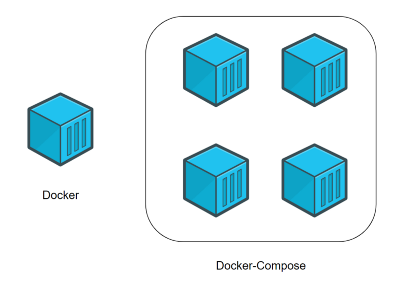
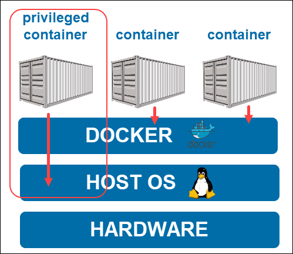

**Docker** - программное обеспечение для автоматизации развёртывания и управления приложениями в среде виртуализации на
уровне операционной системы; позволяет «упаковать» приложение со всем его окружением и зависимостями в контейнер, а
также предоставляет среду по управлению контейнерами.

**Простыми словами**, Докер это инструмент, который позволяет разработчикам, системными администраторам и другим
специалистам деплоить их приложения в песочнице (которые называются контейнерами), для запуска на целевой операционной
системе, например, Linux. Ключевое преимущество Докера в том, что он позволяет пользователям **упаковать приложение со
всеми его зависимостями в стандартизированный модуль** для разработки. В отличие от виртуальных машин, контейнеры не
создают такой дополнительной нагрузки, поэтому с ними можно использовать систему и ресурсы более эффективно.

# Основы

## Компоненты

**Docker Host** - компьютер, на котором работает докер

**Docker Daemon** - фоновый процесс, который работает постоянно и ожидает команды. Знает все о контейнерах, запущенных
на одном хосте

**Docker Client** - клиент, при помощи которого пользователи взаимодействуют с демоном и отправляют ему команды

**Docker Image** - неизменяемый образ, из которого разворачивается контейнер

**Docker Container** - развернутое и запущенное приложение

**Docker Registry** - репозиторий, в котором хранятся образы (Docker Hub)

**Dockerfile** - файл-инструкция для сборки образа

# Docker

## Dockerfile

**Dockerfile** содержит инструкции сборки образа, команды влияют на опреационную систему внутри контейнера, а не на
операционную систему где этот контейнер будет развернут.

Ниже приведен пример Dockerfile для ASP.NET Core 6.0 проекта:

```dockerfile
FROM mcr.microsoft.com/dotnet/aspnet:6.0 AS base
WORKDIR /app
EXPOSE 80

FROM mcr.microsoft.com/dotnet/sdk:6.0 AS build

WORKDIR /src
COPY ["References/References.csproj", "References/"]
COPY ["Data/Data.csproj", "Data/"]
RUN dotnet restore "References/References.csproj"

COPY . .
WORKDIR "/src/References"
RUN dotnet build "References.csproj" -c Release -o /app

FROM build AS publish
RUN dotnet publish "References.csproj" -c Release -o /app

FROM base AS final
WORKDIR /app
COPY --from=publish /app .
ENTRYPOINT ["dotnet", "References.dll"]
```

Разберем приведенный Dockerfile по строчно.

1. Указываем базовый образ, с предустановленным ПО для работы нашего приложения:

```dockerfile
FROM mcr.microsoft.com/dotnet/aspnet:6.0 AS base
```

2. Определение рабочего каталога для нашего приложения

```dockerfile
WORKDIR /app
```

3. Указываем порт, который необходимо открыть - порт на который задействует приложение

```dockerfile
EXPOSE 80
```

4. Мы используем многоступенчатую сборку. При многоступенчатой FROMсборке вы используете несколько операторов в своем
   Dockerfile. Каждая FROMинструкция может использовать другую базу, и каждая из них начинает новый этап сборки. Вы
   можете выборочно копировать артефакты с одного этапа на другой, оставляя в конечном изображении все, что вам не
   нужно.

```dockerfile
FROM mcr.microsoft.com/dotnet/sdk:6.0 AS build
```

5. Копируем файлы проекта, описывающие зависимости и NuGet пакеты, во временную папку `/src` и запускаем восстановление
   пакетов

```dockerfile
# Временная директория
WORKDIR /src
# Копируем файлы проектов
COPY ["References/References.csproj", "References/"]
COPY ["Data/Data.csproj", "Data/"]
# Запускаем восстановление пакетов
RUN dotnet restore "References/References.csproj"
```

6. Копируем все файлы проекта и запускаем сборку

```dockerfile
# Копируем все что находится в текущей директории (контексте сборки Docker)
# в текущую директорию Docker контейнера (указанную в предыдущем шаге "/src")
COPY . .
# Переходим в папку с запускаемым преоктом
WORKDIR "/src/References"
# Запускаем сборку проекта
RUN dotnet build "References.csproj" -c Release -o /app
```

7. Публикация приложения и его зависимостей в папке для развертывания `/app`

```dockerfile
FROM build AS publish
RUN dotnet publish "References.csproj" -c Release -o /app
```

8. Переносим в папку `/app` только необходимое для функционирования приложения (для сокращения размера Docker
   контейнера) и запускаем

```dockerfile
FROM base AS final
WORKDIR /app
COPY --from=publish /app .
# Запуск приложения
ENTRYPOINT ["dotnet", "References.dll"]
```

<a href="#Example-dockerfile">Примеры Dockerfile</a> для проектов написанных на других языках
программирования/фреймворках доступны в разделе "Примеры Dockerfile".

## Инструкции Dockerfile

Ниже предствалены основные инструкции Dockerfile:

1. `FROM` — задаёт базовый (родительский) образ.
2. `LABEL` — описывает метаданные. Например — сведения о том, кто создал и поддерживает образ.
3. `ENV` — устанавливает постоянные переменные среды.
4. `RUN` — выполняет команду и создаёт слой образа. Используется для установки в контейнер пакетов.
5. `COPY` — копирует в контейнер файлы и папки.
6. `ADD` — копирует файлы и папки в контейнер, может распаковывать локальные .tar-файлы.
7. `CMD` — описывает команду с аргументами, которую нужно выполнить когда контейнер будет запущен. Аргументы могут быть
   переопределены при запуске контейнера. В файле может присутствовать лишь одна инструкция CMD.
8. `WORKDIR` — задаёт рабочую директорию для следующей инструкции.
9. `ARG` — задаёт переменные для передачи Docker во время сборки образа.
10. `ENTRYPOINT` — предоставляет команду с аргументами для вызова во время выполнения контейнера. Аргументы не
    переопределяются.
11. `EXPOSE` — указывает на необходимость открыть порт.
12. `VOLUME` — создаёт точку монтирования для работы с постоянным хранилищем.

_Подробнее об инструкциях можно почитать [здесь](https://habr.com/ru/company/ruvds/blog/439980/) или в официальной документации._

## Команды

Основные команды Docker приведены ниже, это команды с которыми вам часто предстоит работать. Они нужны как для развертывания, мониторинга, так и чтения логов контейнеров.

**Управление контейнерами:** 

1. `create` — создание контейнера из образа.
2. `start` — запуск существующего контейнера.
3. `run` — создание контейнера и его запуск.
4. `ps` — вывод списка работающих контейнеров.
5. `inspect` — вывод подробной информации о контейнере (размещение файловой системы, сетевые настройки и многое другое).
6. `logs` — вывод логов.
7. `stop` — остановка работающего контейнера с отправкой главному процессу контейнера сигнала SIGTERM, и, через некоторое время, SIGKILL.
8. `kill` — остановка работающего контейнера с отправкой главному процессу контейнера сигнала SIGKILL.
9. `rm` — удаление остановленного контейнера.

**Управление образами:** 

11. `build` — сборка образа.
12. `push` — отправка образа в удалённый реестр.
13. `history` — вывод сведений о слоях образа.

**Другие:**
14. `docker version` — вывод сведений о версиях клиента и сервера Docker.
15. `docker login` — вход в реестр Docker.
16. `docker system prune` — удаление неиспользуемых контейнеров, сетей и образов, которым не назначено имя и тег.

Пример выполнения некоторых из команд: 

1. Команда `docker ps`:


Выводятся все работающие контейнеры.
Для вывода всех контейнеров (даже тех которые завершились с ошибкой), нужно добавить флаг `-a` == `--all`:


2. Команда `docker logs <container>`:

Выводятся все логи контейнера.


# Docker-Compose

**Docker Compose** — это инструментальное средство, входящее в состав Docker. Оно предназначено для решения задач, связанных с развёртыванием проектов.

## **Разница Docker и Docker Compose**

Docker применяется для управления отдельными контейнерами (сервисами), из которых состоит приложение.

Docker Compose используется для одновременного управления несколькими контейнерами, входящими в состав приложения. Этот инструмент предлагает те же возможности, что и Docker, но позволяет работать с более сложными приложениями.

Docker Compose не только для управления несколькими контейнерами одновременно, но и для облегчения работы с контейнерами. Он предоставляет упрощенный синтаксис написания команд развертывания.



## Конфигурирование docker-compose

<span style="border-bottom: 1px solid #ff8201;">В данном разделе представлены основные, часто встречающиеся конфигурации. На самом деле их очень много, о них можно почитать в официальной документации.</span>


Файл `docker-compose.yml`. Это файл Docker Compose, который будет содержать инструкции, необходимые для запуска и настройки сервисов.

### Пример с минимальной конфигурацией

Пример минимальной конфигурации docker-compose для проекта ASP.NET Core 6.0:

```yaml
# Файл docker-compose должен начинаться с тега версии.
# Мы используем "3" так как кластер ВолгГТУ не поддерживает более свежие версии.
version: '3'

# Следует учитывать, что docker-composes работает с сервисами.
# 1 сервис = 1 контейнер.
# Сервисом может быть клиент, сервер, сервер баз данных...
# Раздел, в котором будут описаны сервисы, начинается с 'services'.
services:
  # Название сервиса
  vnikti_backend:
    # Image - который будет использован при сборке, 
    # если не указан блок build
    image: "vnikti_backend:${TAG}"
    # Переменые среды, которые будут проинициализированы после запуска
    environment:
      - ASPNETCORE_ENVIRONMENT=Staging
    # Информация о контексте сборки
    # и путь к Dockerfile   
    build:
      context: ./
      dockerfile: Dockerfile
    # Порт, который будет открыт наружу Docker контейнера
    # слева порт на машине, где происходит запуск
    # справа порт внутри Docker контейнера
    ports:
      - 6110:8010
```

docker-compose без комментариев: 

```yaml
version: '3'
services:
  vnikti_backend:
    image: "vnikti_backend:${TAG}"
    environment:
      - ASPNETCORE_ENVIRONMENT=Staging
    build:
      context: ./
      dockerfile: Dockerfile
    ports:
    - 6110:8010
```

### Пример с несколькими зависимыми сервисами

Пример конфигурации docker-compose для проекта ASP.NET Core 6.0, состоящего из 3-х модулей, Elastic Search и Kibana:

```yaml
version: '2.2'
services:
  # Main
  niokrmain:
    image: "niokrmain:${TAG}"
    hostname: niokrmain # доменное имя, которое смогут использовать другие контейнеры
    container_name: niokrmain # Название контейнера, после запуска
    restart: always # Если перезапускается машина/падает контейнер он всегда перезапускается
    environment:
      - ASPNETCORE_ENVIRONMENT=Rosseti
    build:
      context: ./
      dockerfile: Main_Dockerfile
    ports:
      - 8001:80
    # Монтирование файловой системы с машины в Docker контейнер
    volumes: 
      - /data/AISNIOKR_DATA:/app/Data
    # Информация о сетях, которые будут доступны контейнеру
    networks:
      - niokr-network

  # Parse Documents
  niokparsedocuments:
    image: "niokparsedocuments:${TAG}"
    hostname: niokparsedocuments
    container_name: niokparsedocuments
    restart: always
    environment:
      - ASPNETCORE_ENVIRONMENT=Production
    build:
      context: ./
      dockerfile: Parse_Documents_Dockerfile
    volumes:
      - /data/AISNIOKR_DATA:/app/Data
    mem_limit: 30g # Ограничение оперативной памяти в 30 ГБ
    networks:
      - niokr-network
    
  # NIOKR Search
  niokwordsearch:
    image: "niokwordsearch:${TAG}"
    hostname: niokwordsearch
    container_name: niokwordsearch
    restart: always
    environment:
      - ASPNETCORE_ENVIRONMENT=Production
    build:
      context: ./
      dockerfile: Word_Search_Dockerfile
    volumes:
      - /data/AISNIOKR_DATA:/app/Data
    networks:
      - niokr-network

      
  # -------------- Services -------------------
  # ElasticSearch 
  elastic:
    image: docker.elastic.co/elasticsearch/elasticsearch:7.11.1
    container_name: elastic
    restart: always
    environment:
      - node.name=elastic
      - cluster.name=es-cluster-7
      - discovery.type=single-node
      - bootstrap.memory_lock=true
      - "ES_JAVA_OPTS=-Xms4g -Xmx4g"
    # Ограничения Docker контейнера
    ulimits:
      memlock:
        soft: -1
        hard: -1
    volumes:
      - es-data01:/usr/share/elasticsearch/data
    ports:
      - 9200:9200
    networks:
      - es-network
      - niokr-network

  # Kibana   
  kibana:
    image: docker.elastic.co/kibana/kibana:7.11.1
    container_name: kibana
    restart: always
    environment:
      ELASTICSEARCH_HOSTS: http://elastic:9200
    ports:
      - 5601:5601
    networks:
      - es-network
      - niokr-network
    # Указываем какие контейнеры необходимо дождаться
    # kibana начнет запуск, только после старта elastic
    depends_on: 
      - elastic

# Информация о подключаемых файловых системой 
volumes:
  es-data01:
    driver: local

# Информация о конфигурации сетей, "как и куда подключаться"
networks:
  # Название, которое будет указываться в запускаемых контейнерах
  es-network:
    driver: bridge
  niokr-network:
    # Сеть уже существует, просто подключаемся к ней
    external: true
    # Распределенная сеть, между несколькими машинами
    driver: overlay
```

# Репозитори. Публичные образы.

Публичные репозитории могут использоваться для размещения образов Docker, откуда могут быть получены всеми желающими. Примерами являются образы, доступные на [Docker Hub](https://hub.docker.com/search?type=image). Многие из них, например, такие, как CentOS, Ubuntu, Jenkins, являются общедоступными для всех. Мы также можем загружать свои образы в публичный репозиторий на Docker Hub.


Что бы получить готовый образ, необходимо открыть его на DockerHub: 


1. Описание образа Docker. Некоторые разработчики описывают очень подробно как использовать, как запускать и какие теги есть у этого контейнера.
2. Комментарии/отзывы об образе. 
3. Теги образа. Выбрав правильный тег мы можем получить последнюю версию образа (обычно у неё тег "latest"), или получить другую версию образа, если нам необходима определенная версия.
4. Пример получения последней версии образа.

# Docker Swarm

**Оркестровка** — это управление и координация взаимодействия между контейнерами. Контейнеры запускаются на хостах, а хосты объединяют в кластер.

У Docker есть стандартный инструмент оркестровки — **Docker Swarm Mode**, или просто Docker Swarm. Он поставляется «из коробки», довольно прост в настройке и позволяет создать простой кластер буквально за минуту.

Кластер Swarm (Docker Swarm Cluster) состоит из нод, которые делят на два типа:

* Управляющая нода (**Manager**). Это нода, которая принимает запросы и распределяет задачи между всеми нодами в кластере. Менеджеров может (и должно) быть несколько, но среди них обязательно есть одна самая главная нода — лидер, который управляет всем кластером.

* Рабочая нода (**Worker**). Подчиненная нода, которая не принимает решений, а просто выполняет отправляемые ей задачи.


В Docker Swarm вместо прямого использования контейнеров используются сервисы (Docker Swarm Service). Они похожи на контейнеры, но всё же это немного другое понятие.

**Сервис** — это что-то вроде уровня абстракции над контейнерами. В Swarm мы не запускаем контейнеры явно — этим занимаются сервисы. Для достижения отказоустойчивости мы лишь указываем сервису количество реплик — нод, на которых он должен запустить контейнеры. А Swarm уже сам проследит за тем, чтобы это требование выполнялось: найдет подходящие хосты, запустит контейнеры и будет следить за ними. Если один из хостов отвалится — создаст новую реплику на другом хосте.

----


Кроме стандартного Docker Swarm есть и другие инструменты оркестровки, например Kubernetes. Это сложная система, которая позволяет построить отказоустойчивую и масштабируемую платформу для управления контейнерами. Он умеет работать не только с контейнерами Docker, но и с другими контейнерами: rkt, CRI-O.

У Kubernetes довольно много возможностей, которые позволяют строить масштабные распределенные системы. Из-за этого порог вхождения в технологию гораздо выше, чем в Swarm. Нужно обладать определенным уровнем знаний, а на первоначальную установку и настройку может уйти несколько дней.


# Что такое привилегированный режим Docker?

Привилегированный режим Docker предоставляет корневые возможности контейнера Docker всем устройствам в хост-системе. Запуск контейнера в привилегированном режиме дает ему возможности хост-компьютера. Например, он позволяет изменять конфигурации App Arm и SELinux .

Благодаря функциям ядра хоста и доступу к устройству вы даже можете установить новый экземпляр платформы Docker в привилегированном контейнере. По сути, этот режим позволяет запускать Docker внутри Docker.



Что бы запустить контейнер в привилигерованном режиме, необходимо выполнить запуск вс флагом `--privileged`, пример:

```dockerfile
sudo docker run --privileged [image_name]
```

# Примеры Dockerfile <a id="Example-dockerfile"></a>

Примеры от начала создания проекта, до его развертывания доступны здесь: 
1. 

## С# 5.0

```dockerfile
FROM mcr.microsoft.com/dotnet/aspnet:5.0 AS base

RUN apt-get update && \
    apt-get install -y libc6-dev && \ 
    apt-get install -y libgdiplus

WORKDIR /app
EXPOSE 80

FROM mcr.microsoft.com/dotnet/sdk:5.0 AS build

WORKDIR /src
COPY ["NIOKR_Parse_Documents/NIOKR_Parse_Documents.csproj", "NIOKR_Parse_Documents/"]
RUN dotnet restore "NIOKR_Parse_Documents/NIOKR_Parse_Documents.csproj"

COPY . .
WORKDIR "/src/NIOKR_Parse_Documents"
RUN dotnet build "NIOKR_Parse_Documents.csproj" -c Release -o /app

FROM build AS publish
RUN dotnet publish "NIOKR_Parse_Documents.csproj" -c Release -o /app

FROM base AS final
WORKDIR /app
COPY --from=publish /app .
ENTRYPOINT ["dotnet", "NIOKR_Parse_Documents.dll"]
```

## Python

```dockerfile
# Image
FROM laudio/pyodbc

# Переменные среды
ENV PYTHONUNBUFFERED 1
ENV FLASK_APP=service

# Открываем порты во внешнюю сеть
EXPOSE 5000
EXPOSE 80

# Копируем все файлы из текущей папки (на машине, где запускаем сборку) в папку UPE_ise_adapter (в контейнере)
COPY . ./UPE_ise_adapter

# Устанавливаем пакеты/зависимости 
RUN pip install -r ./UPE_ise_adapter/requirements.txt

# Запускаем проект
CMD ["python", "-m", "UPE_ise_adapter.service"]
```

## React JS


<span>*</span> В данном контейнере используется React JS приложение, с настроенным проксированием через Nginx


```dockerfile
# Образ
FROM node:13.12.0-alpine as build

# Работаем с папкой /app  в контейнере
WORKDIR /app

# Перменная среды
ENV PATH /app/node_modules/.bin:$PATH

# Копируем файлы 
# слева - файлы на машине, где запускается 
# справа - место в Docker контейнере
COPY package.json ./
COPY package-lock.json ./
COPY . ./

# Установка зависимостей
RUN npm ci --silent
RUN npm install react-scripts@3.4.1 -g --silent
RUN npm run build

# Многоступенчатая сборка, второй образ
FROM nginx:stable-alpine

# Копируем файлы
COPY --from=build /app/dist /usr/share/nginx/html
COPY nginx/nginx.conf /etc/nginx/conf.d/default.conf

# Открываем порт
EXPOSE 80

# Запускаем
CMD ["nginx", "-g", "daemon off;"]
```


## Angular JS

<span>*</span> В данном контейнере используется Angular JS приложение, с настроенным проксированием через Nginx

```dockerfile
# Образ
FROM node:16 as build

# Работаем с папкой /app  в контейнере
WORKDIR /app

# Копируем файлы 
# слева - файлы на машине, где запускается 
# справа - место в Docker контейнере
COPY /employee-accounting/ /app

# Установка зависимостей
RUN npm install
RUN npm run build

# Многоступенчатая сборка, второй образ
FROM nginx:latest

# Копируем файлы
COPY ./nginx/nginx.conf /etc/nginx/nginx.conf
COPY --from=build /app/dist/employee-accounting /usr/share/nginx/html
```

