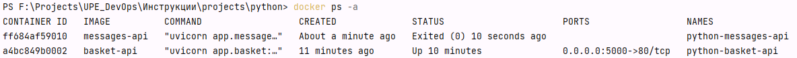
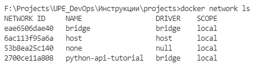
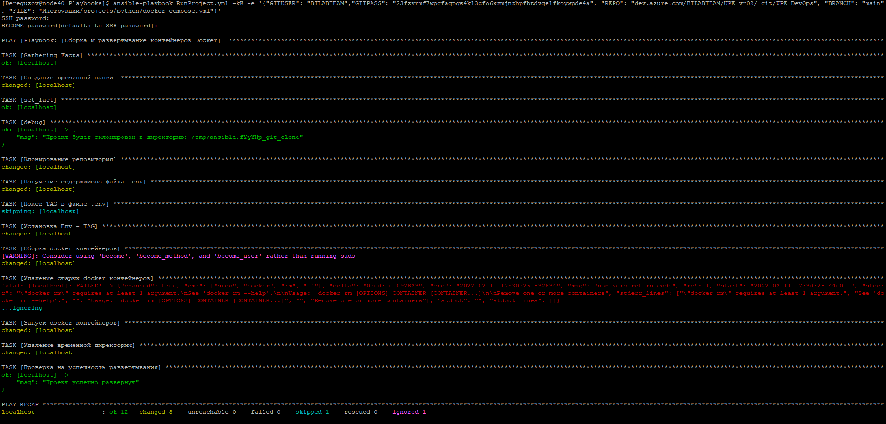

В данном документе представлен пример развертывания приложения/системы от начала до полного деплоя.

Содержатся инструкции по:

[[_TOC_]]

----

# Python проект

## Инициализация проекта

Данный раздел описывает как создать приложение, которое будет запускаться с помощью Docker.

Раздел является **ознакомительным**, для понимания структуры запускаемого проекта

## Создание проекта

Вы можете ознакомиться с проектом самостоятельно

Проект находится
здесь: [Azure DevOps Repository](projects/python)

! Для запуска проекта, требуется установить 2 библиотеки:

```shell
pip install fastapi
pip install uvicorn
```

Проект содержит два файла (= два микросервиса):

- `basket.py` - микросервис, управления корзиной покупок

```py
from fastapi import FastAPI

prefix = '/api/basket'
openapi_url = f'{prefix}/openapi.json'

app = FastAPI(openapi_url=openapi_url)

@app.get(f"{prefix}/ping")
async def ping():
    return "pong"


@app.get(prefix)
async def basket():
    return {
        'Яблоки': {
            'Количество (кг)': 10,
            'Стоимость руб. (1 кг)': 110
        },
        'Конфеты': {
            'Количество (кг)': 1,
            'Стоимость руб. (1 кг)': 160
        },
        'Крупа': {
            'Количество (кг)': 4,
            'Стоимость руб. (1 кг)': 78.50
        },
        'Колбаса': {
            'Количество (кг)': 2,
            'Стоимость руб. (1 кг)': 470
        },
        'Консервы': {
            'Количество (кг)': 0.8,
            'Стоимость руб. (1 кг)': 70
        }
    }
```

- `messages.py` - микросервис, управления сообщениями пользователя

```py
from fastapi import FastAPI

prefix = '/api/messages'
openapi_url = f'{prefix}/openapi.json'

app = FastAPI(openapi_url=openapi_url)

@app.get(f"{prefix}/ping")
async def ping():
    return "pong"


@app.get(prefix)
async def messages():
    return [
        {
            'id': 1,
            'message': 'Сообщение 1'
        },
        {
            'id': 2,
            'message': 'Сообщение 2'
        },
        {
            'id': 3,
            'message': 'Сообщение 3'
        },
    ]
```

Для запуска микросервисов используются команды:

```shell
uvicorn basket:app --host localhost --port 5000
```

```shell
uvicorn messages:app --host localhost --port 5001
```

У проектов есть по 2 метода API:

1. Корзина


2. Сообщения


# Настройка конфигурации Docker

Добавим 2 файла в проект, для конфигурации модулей:

- Basket.dockerfile
- Messages.dockerfile

Содержимое Basket.dockerfile

```dockerfile
# Образ python
FROM python:3.9

# Текущий каталог, в котором будет находится код проекта
WORKDIR /code

# Сначала копируем файл с зависимостями
COPY ./requirements.txt /code/requirements.txt

# Устанавливаем все зависимости
# Опция --no-cache-dir указывает pip не сохранять загруженные пакеты локально,
# так как это возможно только в том случае, если pip будет запущен снова для установки тех же пакетов,
# но это не так при работе с контейнерами.
RUN pip install --no-cache-dir --upgrade -r /code/requirements.txt

# Копируем весь остальной код
COPY ./app /code/app

# Запускаем наше приложение
CMD ["uvicorn", "app.basket:app", "--host", "0.0.0.0", "--port", "80", "--proxy-headers"]
```

Содержимое Basket.dockerfile

```dockerfile
# Образ python
FROM python:3.9

# Текущий каталог, в котором будет находится код проекта
WORKDIR /code

# Сначала копируем файл с зависимостями
COPY ./requirements.txt /code/requirements.txt

# Устанавливаем все зависимости
# Опция --no-cache-dir указывает pip не сохранять загруженные пакеты локально,
# так как это возможно только в том случае, если pip будет запущен снова для установки тех же пакетов,
# но это не так при работе с контейнерами.
RUN pip install --no-cache-dir --upgrade -r /code/requirements.txt

# Копируем весь остальной код
COPY ./app /code/app

# Запускаем наше приложение
CMD ["uvicorn", "app.messages:app", "--host", "0.0.0.0", "--port", "80", "--proxy-headers"]
```

<span style="color: yellow">┌──────────────────────────────────────────────────────────────┐<br/></span>
Дальнейшая информация представлена для ознакомления      <br/>
запускать и собирать контейнеры лучше с помощью <a href="#docker-compose">docker-compose</a> <br/>
<span style="color: yellow">└──────────────────────────────────────────────────────────────┘<br/></span>

Для сборки сервисов, используем следующие команды:

```shell
docker build -f .\Basket.dockerfile -t basket-api .
```

```shell
docker build -f .\Messages.dockerfile -t messages-api .
```

После того как Docker соберет проекты, мы можем посмотреть наши собранные образы, командой `docker image ls`:


Развернем приложения с помощью следующих команд:

1. Basket API - микросервис будет развернут на 5000 порту, запущенный контейнер будет иметь название `python-basket-api`

```shell
docker run -p 5000:80 --hostname python-basket-api --name python-basket-api -d basket-api
```

Флаги:

- `--hostname <hostname>` - имя по которому контейнеры могут общаться, находясь в одной сети
- `--name <name>` - название, которое будет присвоено контейнеру после запуска
- `-d` или `--detach` - запускает контейнер в фоновом режиме и печатает идентификатор контейнера. (Без этого флага
  контейнер будет работать пока вы не закроете окно консоли или не нажмете сочетание клавиш `ctrl+c`)
- `-p <port>:<container_port>` - указывает какой порт привязать к серверу на котором разворачивается контейнер. `<port>`
    - порт сервера. `<container_port>` - порт внутри контейнера.

Последним аргументом команды `docker run` является название собранного образа `basket-api`.

2. Messages API - микросервис будет развернут на 5001 порту, запущенный контейнер будет иметь
   название `python-messages-api`

```shell
docker run -p 5001:80 --hostname python-messages-api --name python-messages-api -d messages-api
```

После запуска контейнеров, мы можем с помощью команды `docker ps` посмотреть работающие контейнеры:


Если контейнер не запустился или произошла ошибка, мы можем посмотреть в какой момент он перестал работать
комнандой `docker ps -a`:



Командой `docker logs <NAME_CONTAINER>` мы можем посмотреть логи контейнера:


# Настройка конфигурации nginx <span id="nginx-python"></span>

В проекте создадим директорию `nginx`, а в ней создадим файл `default.conf` и наполним его следующим содержимым:

```dockerfile
server {
  listen 80;
  listen [::]:80;
  server_name _;
  server_tokens off;

  include /etc/nginx/conf.d/locations/*.locations;

  # Корзина
  location /api/basket/ {
    proxy_pass http://python-basket-api;
  }
  # Корзина - документация (OpenAPI)
  location /api/basket/docs {
    proxy_pass http://python-basket-api/docs;
  }

  # Сообщения
  location /api/messages/ {
    proxy_pass http://python-messages-api;
  }
  # Сообщения - документация (OpenAPI)
  location /api/messages/docs {
    proxy_pass http://python-messages-api/docs;
  }
}
```

# Настройка docker-compose <span id="docker-compose"></span>

В корне проекта создадим файл `docker-compose.yml` и заполним его следующей конфигурацией:

```yaml
version: '3'

services:
  basket:
    container_name: python-basket-api
    # Не может отличаться от container_name,

    # следовательно значение по умолчанию равно container_name
    hostname: python-basket-api
    restart: always
    build:
      context: ./
      dockerfile: ./Basket.dockerfile
    environment:
      - ENVIRONMENT=Production
    networks:
      - python-api-tutorial
  messages:
    container_name: python-messages-api
    restart: always
    build:
      context: ./
      dockerfile: ./Messages.dockerfile
    environment:
      - ENVIRONMENT=Production
    networks:
      - python-api-tutorial
  nginx:
    container_name: python-nginx-api
    hostname: python-nginx-api
    image: nginx
    restart: unless-stopped
    ports:
      - 6000:80
    volumes:
      - ./nginx/default.conf:/etc/nginx/conf.d/default.conf
    networks:
      - python-api-tutorial

networks:
  python-api-tutorial:
    external:
      name: python-api-tutorial
```

Для запуска необходимо создать сеть, в которой будут работать контейнеры `python-api-tutorial` командой:

```yaml
docker network create python-api-tutorial
```

Список существующих сетей можно посмотреть командой:

```yaml
docker network ls
```



Для сборки проекта воспользуемся командой:

```yaml
docker-compose -f docker-compose.yml build
```

Для запуска проекта воспользуемся командой:

```yaml
docker-compose -f docker-compose.yml up -d
```

После запуска проекта, мы можем посмотреть запущенные контейнеры, командой:

```dockerfile
docker ps
```


Мы видим что запущено 3 контейнера, теперь доступ к API сообщений и корзины осуществляется через nginx, он доступен на
6000 порту.

Документация API этих модулей доступна по ссылкам:

http://localhost:6000/api/messages/docs


http://localhost:6000/api/basket/docs


# Описание строки запуска с помощью Ansible

Инструкция конфигурирования команды запуска приложения с помощью Ansible доступна [здесь](Ansible.md#запуск-проектов).

Для запуска сконфигурированного проекта, нужно использовать следующую команду запуска с помощью Ansible:

<span id="ansible-command"></span>

```dockerfile
ansible-playbook RunProject.yml -kK -e '{"GITUSER": "BILABTEAM","GITPASS": "23fzyrmf7wpgfagpqs4kl3cfo6xzmjnzhpfbtdvgelfkoywpde4a", "REPO": "dev.azure.com/BILABTEAM/UPE_vr02/_git/UPE_DevOps", "BRANCH": "main", "FILE": "Инструкции/projects/python/docker-compose.yml"}'
```

# Развертывание на кластере

## Подключение к кластеру

## Развертывание

Переходим в папку с плейбуками

```
cd ~/Playbooks
```

Перед началом развертывания нужно удостоверится в существовании сети `python-api-tutorial`, командой:

```dockerfile
docker network ls
```

Если сети не существует, то создаем её командой:

```dockerfile
docker network create python-api-tutorial
```

Запускаем приложение сформированной <a href="#ansible-command">командой</a>.

Успешный запуск выглядит примерно так:

