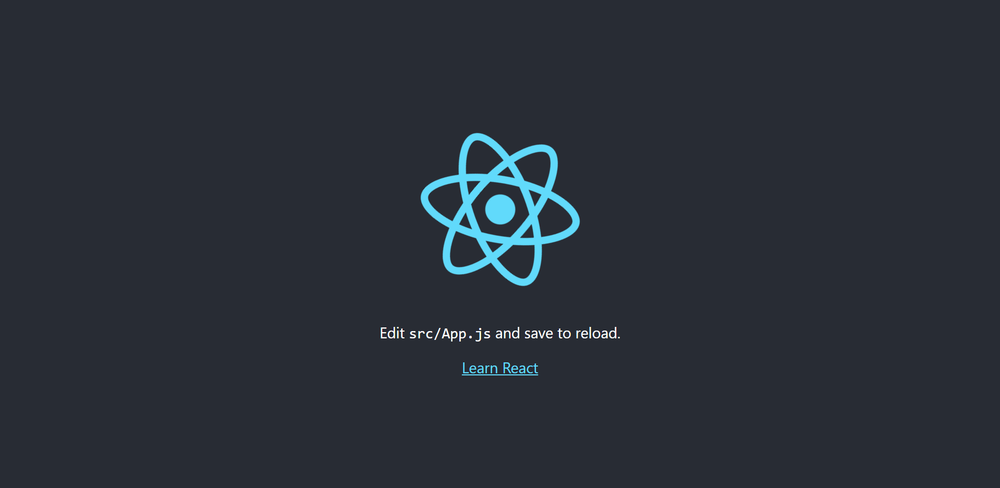
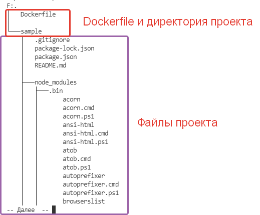
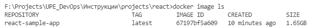
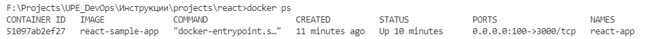
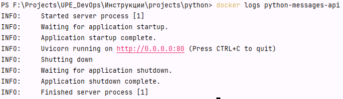
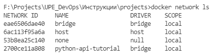
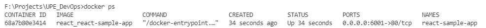
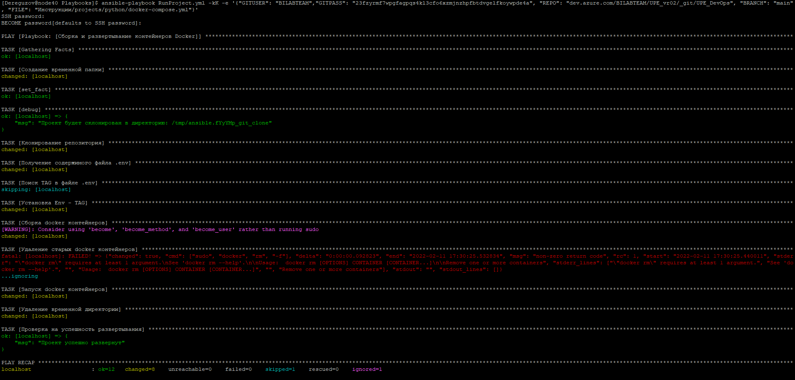

<b style="color: red"><h1>Инструкция написана не до конца !</h1></b>


В данном документе представлен пример развертывания приложения/системы от начала до полного деплоя.

Содержатся инструкции по:

[[_TOC_]]

----

# React проект

## Инициализация проекта

Данный раздел описывает как создать приложение, которое будет запускаться с помощью Docker.

Раздел является **ознакомительным**, для понимания структуры запускаемого проекта

## Установка зависимостей <span id="install"></span>

В данном разделе описаны установленные зависимости, для создания проекта на React.

Установка React была выполнена следующей командой: 
```dockerfile
npm install -g create-react-app@5.0.0
```

## Создание проекта

Вы можете ознакомиться с проектом самостоятельно

Проект находится
здесь: [Azure DevOps Repository](projects/react)


! Для запуска проекта, требуется установить [библиотеку create-react-app](#install).

Создадим проект командой:

```shell
npm init react-app sample --use-npm
```

*Для запуска существующего [проекта](projects/react) необходимо сначала установить все зависимости, командой, находясь в папке с проектом:
```dockerfile
npm install
```

Для запуска проекта используем команду:

```shell
npm start
```

По умолчанию проект запустится по следующему адресу: http://localhost:3000/


Стартовая страница выглядит следующим образом:


# Настройка конфигурации Docker

Добавим Dockergile файла в проект.

Так как у нас один запускаемый проект (см. инструкцию к Python, там несколько модулей, следовательно, нужно несколько Dockerfile), то можно создать без указания расширения, полное название файла: `Dockerfile`

Dockerfile необходимо разместить на одном уровне с директорией проекта:



Содержимое `Dockerfile`:

```dockerfile
# Образ python
FROM python:3.9

# Текущий каталог, в котором будет находится код проекта
WORKDIR /code

# Сначала копируем файл с зависимостями
COPY ./requirements.txt /code/requirements.txt

# Устанавливаем все зависимости
# Опция --no-cache-dir указывает pip не сохранять загруженные пакеты локально,
# так как это возможно только в том случае, если pip будет запущен снова для установки тех же пакетов,
# но это не так при работе с контейнерами.
RUN pip install --no-cache-dir --upgrade -r /code/requirements.txt

# Копируем весь остальной код
COPY ./app /code/app

# Запускаем наше приложение
CMD ["uvicorn", "app.basket:app", "--host", "0.0.0.0", "--port", "80", "--proxy-headers"]
```

Добавим файл `.dockerignore`, с содержимым: 

```dockerfile
# Файлы
Dockerfile
.dockerignore
.gitignore
README.md
npm-debug.log

# Директории
build
node_modules
```

<span style="color: yellow">┌──────────────────────────────────────────────────────────────┐<br/></span>
Дальнейшая информация представлена для ознакомления      <br/>
запускать и собирать контейнеры лучше с помощью <a href="#docker-compose">docker-compose</a> <br/>
<span style="color: yellow">└──────────────────────────────────────────────────────────────┘<br/></span>

Для сборки проекта, используем следующую команду:

```shell
docker build -f Dockerfile -t react-sample-app .
```

После того как Docker соберет проекты, мы можем посмотреть наши собранные образы, командой `docker image ls`:



Развернем приложения с помощью следующих команд:

Basket API - микросервис будет развернут на 5000 порту, запущенный контейнер будет иметь название `python-basket-api`

```shell
docker run -p 100:3000 --hostname react-app --name react-app -d react-sample-app
```

Флаги:

- `--hostname <hostname>` - имя по которому контейнеры могут общаться, находясь в одной сети
- `--name <name>` - название, которое будет присвоено контейнеру после запуска
- `-d` или `--detach` - запускает контейнер в фоновом режиме и печатает идентификатор контейнера. (Без этого флага
  контейнер будет работать пока вы не закроете окно консоли или не нажмете сочетание клавиш `ctrl+c`)
- `-p <port>:<container_port>` - указывает какой порт привязать к серверу на котором разворачивается контейнер. `<port>`
   - порт сервера. `<container_port>` - порт внутри контейнера.

Последним аргументом команды `docker run` является название собранного образа `react-sample-app`.

Если запуск прошёл успешно, то приложение должно быть доступно по следующему адресу: http://localhost:100


После запуска контейнеров, мы можем с помощью команды `docker ps` посмотреть работающие контейнеры:



Если контейнер не запустился или произошла ошибка, мы можем посмотреть в какой момент он перестал работать
комнандой `docker ps -a`:


Командой `docker logs <NAME_CONTAINER>` мы можем посмотреть логи контейнера:



# Настройка Production конфигурации и nginx <span id="nginx-python"></span>

Для сборки проекта в Production режиме, нужно создать файл `Dockerfile.prod` и наполнить его следующим содержимым: 

```dockerfile
# Официальный номер Node
FROM node as build
# Установка папки по умолчанию (в контейнере)
WORKDIR /app

# Добавление пути `/app/node_modules/.bin` в переменную среды $PATH
ENV PATH /app/node_modules/.bin:$PATH

# Установка зависимостей
COPY sample/ ./
RUN npm install

# Сборка проекта
RUN npm run build

# Production окружение 
FROM nginx:stable-alpine
COPY --from=build /app/build /usr/share/nginx/html

COPY nginx/default.conf /etc/nginx/conf.d/default.conf
EXPOSE 80
CMD ["nginx", "-g", "daemon off;"]
```

В проекте создадим директорию `nginx`, а в ней создадим файл `default.conf` и наполним его следующим содержимым:

```dockerfile
server {

  listen 80;

  location / {
    root   /usr/share/nginx/html;
    index  index.html index.htm;
    try_files $uri $uri/ /index.html;
  }

  error_page   500 502 503 504  /50x.html;

  location = /50x.html {
    root   /usr/share/nginx/html;
  }

}
```

Для сборки можно использовать следующую команду: 
```dockerfile
docker build -f Dockerfile.prod -t react-sample-app .
```

# Настройка docker-compose <span id="docker-compose"></span>

В корне проекта создадим файл `docker-compose.yml` и заполним его следующей конфигурацией:

```yaml
version: '3'

services:

  react-sample-app:
    container_name: react-sample-app
    build:
      context: .
      dockerfile: Dockerfile.prod
    ports:
      - 6001:80
    networks:
      - python-api-tutorial

networks:
  python-api-tutorial:
    external:
      name: python-api-tutorial
```


Если мы хотим чтобы наше приложение имело доступ к API сервисов, написанных на Python, нужно поместить их в одну сеть `python-api-tutorial`.

Если сети ещё не существует,то для запуска необходимо создать сеть, в которой будут работать контейнеры `python-api-tutorial` командой:

```yaml
docker network create python-api-tutorial
```

Список существующих сетей можно посмотреть командой:

```yaml
docker network ls
```



Для сборки проекта воспользуемся командой:

```yaml
docker-compose -f docker-compose.yml build
```

Для запуска проекта воспользуемся командой:

```yaml
docker-compose -f docker-compose.yml up -d
```

После запуска проекта, мы можем посмотреть запущенные контейнеры, командой:

```dockerfile
docker ps
```




Мы видим что контейнера с приложением запущен, теперь доступ осуществляется через nginx, он доступен на **6001** порту.

http://localhost:6001

# Описание строки запуска с помощью Ansible

Инструкция конфигурирования команды запуска приложения с помощью Ansible доступна [здесь](Ansible.md#запуск-проектов).

<span id="ansible-command"></span>

```dockerfile
ansible-playbook RunProject.yml -kK -e '{"GITUSER": "BILABTEAM","GITPASS": "23fzyrmf7wpgfagpqs4kl3cfo6xzmjnzhpfbtdvgelfkoywpde4a", "REPO": "dev.azure.com/BILABTEAM/UPE_vr02/_git/UPE_DevOps", "BRANCH": "main", "FILE": "Инструкции/projects/react/docker-compose.yml"}'
```


# Развертывание на кластере

## Подключение к кластеру

## Развертывание

Переходим в папку с плейбуками

```
cd ~/Playbooks
```

Перед началом развертывания нужно удостоверится в существовании сети `python-api-tutorial`, командой:

```dockerfile
docker network ls
```

Если сети не существует, то создаем её командой:

```dockerfile
docker network create python-api-tutorial
```

Запускаем приложение сформированной <a href="#ansible-command">командой</a>.

Успешный запуск выглядит примерно так:

