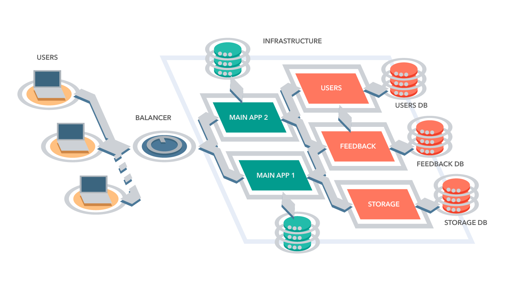

<h1>Курс "Облачные и туманные вычисления"</h1>

**Что предстоит узнать на курсе:** 
1. Как разрабатываются веб-приложения
2. Что такое Docker и как с ним работать
3. Как сервисы запускаются в Production
4. ...

**Какие технологии будут использоваться:**
1. Backend - Python, C# или другие (кроме PHP)
2. Frontend - React, Angular или другие
3. Docker, Docker Swarm - Контейнеризация разработанных сервисов
4. Ansible - "Автоматизация" развертывания
5. ...

Весь курс мы будем стремиться к реализации следующей архитектуры системы: 

# Лабораторные работы

1. [Лабораторная работа №1](Lessons/Lesson1/Challenge1.md)

* Определение темы разработки
* Поиск команды для работки
* Реализация простого веб-приложения

2. [Лабораторная работа №2](Lessons/Lesson2/Challenge2.md)

* Разбиение монолита на микросервисы
* Работа с Docker
* Конфигурация Docker и docker-compose

3. [Лабораторная работа №3](Lessons/Lesson3/Challenge3.md)

* Настройка Nginx
  * Проксирование запросов
  * Единая точка входа
* Описание получившейся системы
* Заключение